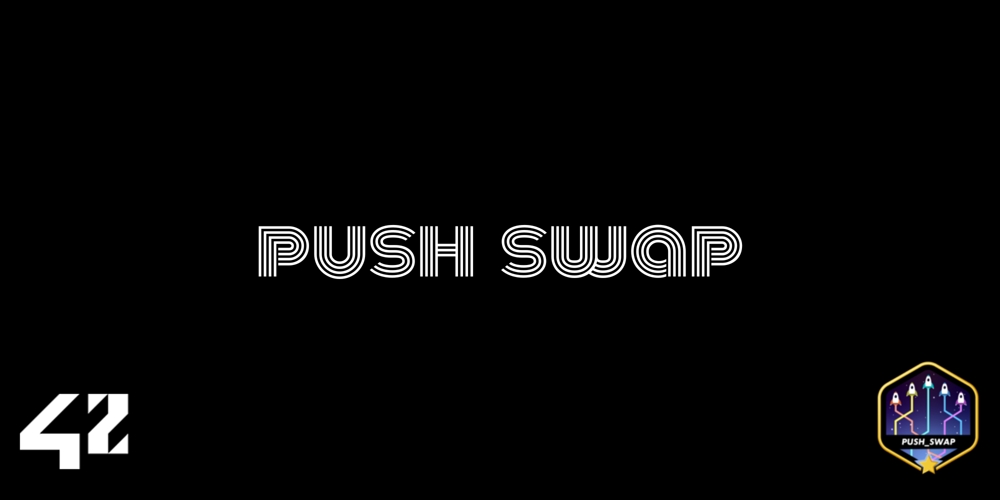

title: Push Swap



<p align="center">


</p>

# Table of Contents <span class="tag" tag-name="TOC_2"><span class="smallcaps">TOC_2</span></span> [table-of-contents]

-   [Objects](#objects)
    -   [Set of IntValues](#set-of-intvalues)
    -   [Stack 1](#stack-1)
    -   [Stack 2](#stack-2)
    -   [Set of instructions](#set-of-instructions)
-   [Goal](#goal)
    -   [Input](#input)
    -   [Output](#output)
-   [Evaluation](#evaluation)
-   [Game Rules](#game-rules)
    -   [V1](#v1)
-   [The Program](#the-program)
    -   [Execution](#execution)
    -   [Display](#display)
    -   [Error](#error)

# Objects

## Set of IntValues

## Stack 1

## Stack 2

## Set of instructions

# Goal

-   program called `push_swap`

## Input

-   [2.1](#*Set of IntValues)

## Output

-   print on standard output
-   smallest program using Push_swap instruction language, to sort the
    integers

# Evaluation

-   only by human beings, therefore no restriction on orgranization

-   executable: `push_swap`

-   submit a `Makefile`

    -   must compile the project
    -   must contain usual rules

-   `libft` allowed with own `Makefile`

-   `normed`

-   no unexpected quit of program

-   no memory leaks

-   allowed functions

    -   write
    -   read
    -   malloc
    -   free
    -   exit

-   smallest list of instructions possible to sort the stack

    -   will be compared to a maximum number of operations tolerated

-   will be checked with checker program

    ``` shell
    $>ARG="4 67 3 87 23"; ./push_swap $ARG | ./checker_OS $ARG
    OK
    ```

    -   displays KO
    -   available in the resources of the project on the intranet

# Game Rules

## V1

### start

1.  a (stack)

    -   contianes random number of either positive of negative numbers
        without any `duplicates`

2.  b (stack)

    -   empty

### goal

-   sort numbers into stack a
-   ascending order

### operations

| short            | What it does                                                                   |
|------------------|--------------------------------------------------------------------------------|
| Swapping         |                                                                                |
| sa               | swap first 2 elements at the top of stack a                                    |
|                  |                                                                                |
| sb               | swap first 2 elements at the top of stack b                                    |
|                  |                                                                                |
| ss               | sa and sb at the same time                                                     |
|                  |                                                                                |
| Pushing          |                                                                                |
| pa               | push a - take the first element at the top of b and put it at the top of a. Do |
|                  | nothing if b is empty.                                                         |
| pb               | push b - take the first element at the top of a and put it at the top of b. Do |
|                  | nothing if a is empty.                                                         |
| Rotating         |                                                                                |
| ra               | rotate a - shift up all elements of stack a by 1. The first element becomes    |
|                  | the last one.                                                                  |
| rb               | rotate b - shift up all elements of stack b by 1. The first element becomes    |
|                  | the last one.                                                                  |
| rr               | ra and rb at the same time.                                                    |
|                  |                                                                                |
| Reverse Rotating |                                                                                |
| rra              | reverse rotate a - shift down                                                  |
| rrb              | reverse rotate b - shift down all elements of stack b by 1. The last element   |
|                  | becomes the first one.                                                         |
| rrr              | rra and rrb at the same time.                                                  |

# The Program

## Execution

-   First argument at the top of the stack

``` shell
./push_swap 2 1 3 6 5 8
```

## Display

-   smallest list of instructions possible to sort the stack
    -   will be compared to a maimum number of operations tolerated
-   instructions must be seperated by '`\n`{=latex}'

## Error

-   display `Error` followed by a '`\n`{=latex}' on standard error
    -   ☐ not integers
        -   bigger than integer
        -   duplicates
        -   characters
